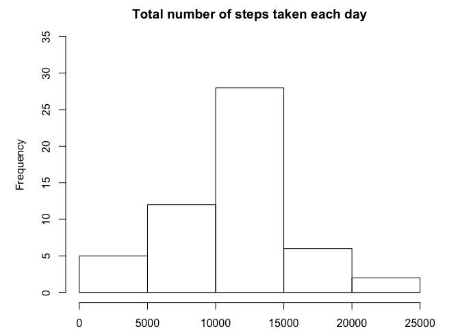
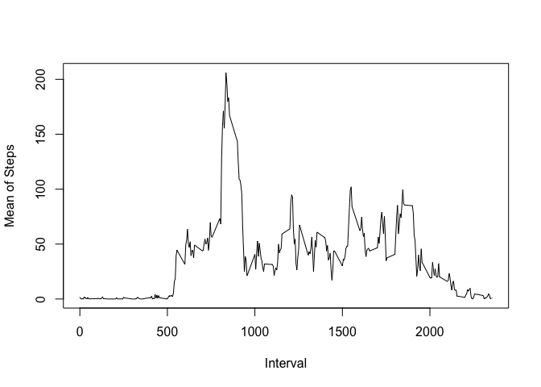
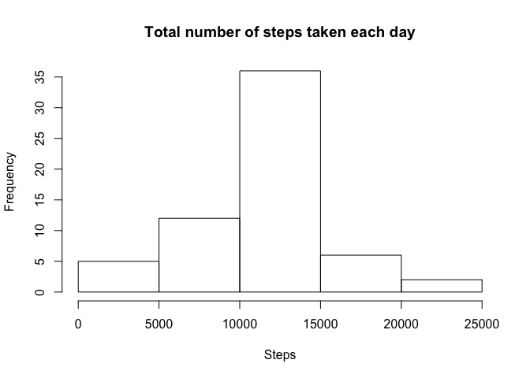
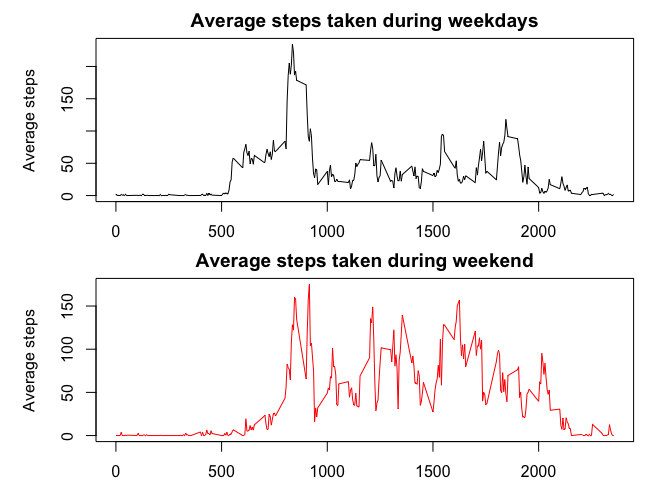

Question 1: What is mean total number of steps taken per day?
First of all, let's load the data!


```r
library(knitr)
x <- read.csv("activity.csv", header = TRUE, sep = ",")
```
Then, I calculate the sum of steps taken per day, and then plot the histogram

```r
x1 <- x[complete.cases(x),]
steps_sum <- tapply(x1$steps, x1$date, sum)
par(mfrow = c(1,1), mar = c(2,5,2,2)) 
hist(steps_sum, xlab = "Steps", main = "Total number of steps taken each day", ylim = c(0,35))
```

<!-- -->
So, the mean and standard deviation for of the total number taken per day are:

```r
mean(steps_sum, na.rm = TRUE)
```

```
## [1] 10766.19
```

```r
sd(steps_sum, na.rm = TRUE)
```

```
## [1] 4269.18
```
---
Question 2: What is the average daily activity pattern?
First of all, I calculate the mean of steps taken per each day and plot them versus the intervals.

```r
interval_mean <- tapply(x1$steps, x1$interval, mean)
interval <- data.frame(unique(x1$interval), interval_mean)
plot(unique(x1$interval),interval_mean, type = "l", xlab = "Interval", ylab = "Mean of Steps")
```

<!-- -->
So the maximum number of steps is in the following interval: 

```r
interval[interval$interval_mean == max(interval$interval_mean), 1]
```

```
## [1] 835
```
---
Question 3: Imputing missing values
The report of the total number of NAs values is here reported

```r
sapply(x, function(x) sum(is.na(x)))
```

```
##    steps     date interval 
##     2304        0        0
```
My substitution strategy is using the mean for that 5-minute interval

```r
test <- data.frame(cbind(is.na(x$steps), x$interval))
for (i in 1:nrow(test)) {
  if (test[i,1] == 1) {
    for (j in 1:nrow(interval)) {
      if (test[i,2] == interval[j,1]) {
          test[i,1] <- interval[j,2]
      } 
    }
  }
}
x[is.na(x)]<-0
x$steps <- x$steps + test$X1
```
I then plot the histogram of total number of steps taken each day and mean and standard deviation.

```r
steps_sum2 <- tapply(x$steps, x$date, sum)
hist(steps_sum2, xlab = "Steps", main = "Total number of steps taken each day")
```

<!-- -->

```r
mean(steps_sum2, na.rm = TRUE)
```

```
## [1] 10766.19
```

```r
sd(steps_sum2, na.rm = TRUE)
```

```
## [1] 3974.391
```
We can see that mean value is the same, while standard deviation has dropped; additionally, frequency of steps between 10000 and 15000 steps has increased
---
Question 4: Are there differences in activity patterns between weekdays and weekends?
I will load the data again, then create a new column to identify weekdays and weekends.

```r
x <- read.csv("activity.csv", header = TRUE, sep = ",")
week <- weekdays(as.Date(x$date))
for (i in 1:length(week)) {
  if (week[i] == "Saturday" | week[i] == "Sunday") {
    week[i] <- "weekend"
  } else 
    week[i] <- "weekdays"
}
x <- cbind(x, as.factor(week))
```
I will then subset the data and ignore NAs values, then plot the 5-minute interval (x-axis) and the average number of steps taken, averaged across all weekday days or weekend days (y-axis)

```r
x_days <- subset(x, week == "weekdays")
x_end <- subset(x, week == "weekend")
x_days <- x_days[complete.cases(x_days),]
x_end <- x_end[complete.cases(x_end),]
interval_mean_days <- tapply(x_days$steps, x_days$interval, mean)
interval_mean_end <- tapply(x_end$steps, x_end$interval, mean)
par(mfrow = c(2,1), mar = c(2,5,2,2)) 
plot(unique(x$interval), interval_mean_days, type = "l", col = "black", xlab = "Interval", ylab = "Average steps", main = "Average steps taken during weekdays")
plot(unique(x$interval), interval_mean_end, type = "l", col = "red", xlab = "Interval", ylab = "Average steps", main = "Average steps taken during weekend")
```

<!-- -->


